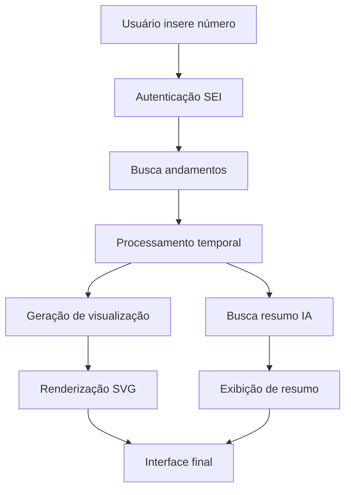

# Análise Completa e Detalhada - Visualizador de Processos SEI

## 📋 Resumo Executivo

Este projeto é um **Visualizador de Processos SEI** desenvolvido para o governo do Piauí (SEAD-PI), criado como uma aplicação web moderna que permite visualizar e analisar fluxos de processos do Sistema Eletrônico de Informações (SEI) de forma interativa e intuitiva.

### 🎯 Objetivo Principal
Proporcionar uma interface visual avançada para acompanhar a tramitação de processos administrativos, facilitando a compreensão do fluxo temporal e das etapas do processo através de visualizações gráficas e resumos automatizados por IA.

---

## 🏗️ Arquitetura e Stack Tecnológica

### Framework e Runtime
- **Next.js 15.2.3** - Framework React com renderização server-side
- **React 18.3.1** - Biblioteca de interface de usuário
- **TypeScript** - Linguagem principal com tipagem estática
- **Node.js 20-alpine** (Docker) - Runtime JavaScript

### Interface e Estilização
- **Tailwind CSS 3.4.1** - Framework CSS utilitário
- **Radix UI** - Componentes acessíveis e personalizáveis:
  - Accordion, Alert Dialog, Avatar, Button, Card
  - Dropdown Menu, Dialog, Label, Select, Switch, Tabs
  - Progress, Slider, Tooltip, e muitos outros
- **Lucide React** - Ícones SVG otimizados
- **CSS Variables** - Sistema de cores personalizável com suporte a modo escuro

### Gerenciamento de Estado e Formulários
- **React Hook Form 7.54.2** - Gerenciamento de formulários performático
- **Zod 3.24.2** - Validação de esquemas TypeScript-first
- **TanStack Query 5.66.0** - Gerenciamento de estado servidor/cache

### Visualização de Dados
- **Recharts 2.15.1** - Biblioteca de gráficos React
- **SVG personalizado** - Visualizações de fluxo de processo customizadas
- **Date-fns 3.6.0** - Manipulação e formatação de datas

### APIs e Integração
- **Firebase 11.7.3** - Plataforma de desenvolvimento (configurado mas não usado ativamente)
- **Google AI (Genkit) 1.8.0** - Integração com IA para resumos automatizados
- **Fetch API** - Comunicação com APIs REST do SEI

---

## 🗂️ Estrutura de Diretórios

```
studio/
├── src/
│   ├── app/                    # Rotas e páginas (App Router Next.js)
│   │   ├── page.tsx           # Página principal
│   │   ├── layout.tsx         # Layout raiz
│   │   ├── login/page.tsx     # Página de login
│   │   └── sei-actions.ts     # Server actions para API SEI
│   ├── components/            # Componentes React
│   │   ├── ui/               # Componentes de interface (Radix UI)
│   │   ├── process-flow/     # Componentes específicos do fluxo
│   │   └── ApiHealthCheck.tsx # Monitor de saúde das APIs
│   ├── types/                # Definições TypeScript
│   │   └── process-flow.ts   # Tipos do domínio de processos
│   ├── lib/                  # Utilitários e helpers
│   │   ├── process-flow-utils.ts # Lógica de processamento
│   │   └── utils.ts          # Utilitários gerais
│   ├── hooks/                # React Hooks customizados
│   │   ├── use-toast.tsx     # Hook para notificações
│   │   └── use-persisted-auth.tsx # Hook para autenticação
│   └── data/                 # Dados estáticos e mocks
├── public/                   # Arquivos estáticos
├── docs/                     # Documentação
├── .next/                    # Build Next.js
├── Dockerfile               # Containerização
├── docker-compose.yml       # Orquestração (se existir)
└── package.json            # Dependências e scripts
```

---

## 🔧 Funcionalidades Principais

### 1. **Sistema de Autenticação SEI**
- **Login integrado** com API do SEI do Piauí
- **Validação de credenciais** (usuário, senha, órgão)
- **Cache de tokens** com expiração automática (30 minutos)
- **Seleção de órgãos** pré-configurados (SEAD-PI, GOV-PI, etc.)
- **Persistência de sessão** no navegador

### 2. **Visualização de Fluxo de Processos**
- **Interface gráfica SVG** personalizada para representar andamentos
- **Timeline visual** com conexões entre etapas
- **Swimlanes por unidade** organizacional
- **Cores semânticas** por tipo de tarefa:
  - Verde: Conclusão de processo
  - Azul: Recebimento de processo  
  - Marrom: Remessa de processo
  - Laranja: Geração de procedimento
  - Roxo: Reabertura de processo
- **Modo resumido** que agrupa tarefas menores
- **Navegação temporal** (ir para início/fim do fluxo)

### 3. **Busca e Carregamento de Dados**
- **Busca por número de processo** na API SEI
- **Upload de arquivos JSON** para análise offline
- **Seleção de unidade** para contexto de consulta
- **Carregamento paginado** otimizado para grandes volumes
- **Unidades com processo aberto** listadas em sidebar

### 4. **Análise Automatizada por IA**
- **Resumo inteligente** do processo gerado por IA
- **API de resumo dedicada** (SoberaniA)
- **Processamento assíncrono** não-bloqueante
- **Contexto temporal** e análise de duração de etapas

### 5. **Interface Responsiva e Acessível**
- **Design mobile-first** responsivo
- **Componentes acessíveis** (Radix UI)
- **Temas personalizáveis** (CSS variables)
- **Loading states** e feedback visual
- **Toasts informativos** para ações do usuário

### 6. **Monitoramento e Saúde do Sistema**
- **Health checks** das APIs em tempo real
- **Status visual** de conectividade
- **Tratamento robusto de erros** com mensagens contextuais
- **Logs detalhados** para debugging

---

## 📊 Fluxo de Dados e Integrações

### APIs Integradas

#### **1. API SEI do Piauí**
- **Base URL**: `https://api.sei.pi.gov.br/v1`
- **Endpoints utilizados**:
  - `POST /orgaos/usuarios/login` - Autenticação
  - `GET /unidades/{id}/procedimentos/andamentos` - Andamentos do processo
  - `GET /unidades/{id}/procedimentos/consulta` - Consulta de processos
  - `GET /orgaos` - Health check

#### **2. API de Resumo (SoberaniA)**
- **Base URL**: `https://api.sei.agentes.sead.pi.gov.br`
- **Endpoints utilizados**:
  - `GET /processo/resumo-completo/{numero}` - Resumo automatizado
  - `GET /processo/resumo-documento/{numero}` - Resumo de documentos
  - `GET /health` - Health check

### Processamento de Dados



---

## 🔒 Segurança e Autenticação

### Medidas de Segurança Implementadas
- **Autenticação baseada em token** JWT
- **Cache seguro** de credenciais no cliente (temporário)
- **Validação server-side** de todas as entradas
- **Headers de segurança** configurados
- **Sanitização de dados** antes da renderização
- **Rate limiting** implícito via API SEI

### Considerações de Produção
- **Aviso explícito** sobre armazenamento temporário de credenciais
- **Recomendação** para métodos mais seguros em produção
- **Expiração automática** de tokens de autenticação
- **Logs de segurança** para auditoria

---

## 🐳 Containerização e Deploy

### Dockerfile Multi-stage
```dockerfile
# Estágio de build
FROM node:20-alpine AS builder
WORKDIR /app
COPY package.json package-lock.json ./
RUN npm ci
COPY . .
RUN npm run build

# Estágio de produção
FROM node:20-alpine AS runner
WORKDIR /app
ENV NODE_ENV production
COPY --from=builder /app/.next/standalone ./
EXPOSE 3050
CMD ["node", "server.js"]
```

### Configuração de Build
- **Build standalone** habilitado no Next.js
- **Otimização** de imagens remotas (placehold.co)
- **TypeScript** e ESLint ignorados durante build (desenvolvimento)
- **Port 3050** configurado para produção

---

## 🎨 Design System e UX

### Paleta de Cores
- **Primary**: Verde institucional (#107527)
- **Secondary**: Azul governo (#164194)  
- **Accent**: Amarelo (#F7B600)
- **Destructive**: Vermelho (#E63312)
- **Muted**: Cinza adaptativo

### Tipografia
- **Font Principal**: Geist Sans
- **Font Monospace**: Geist Mono
- **Tamanhos**: Sistema responsivo com Tailwind

### Componentes Padronizados
- **Buttons**: Variantes (default, destructive, outline, ghost)
- **Cards**: Layout consistente com header/content
- **Forms**: Validação visual integrada
- **Modals**: Acessíveis com Radix Dialog
- **Navegação**: Breadcrumbs e estados ativos

---

## 📈 Performance e Otimizações

### Otimizações Implementadas
- **Code splitting** automático do Next.js
- **Server components** para reduzir bundle JavaScript
- **Image optimization** nativa do Next.js
- **Cache inteligente** de tokens de autenticação
- **Lazy loading** de componentes pesados
- **Debounce** em campos de busca

### Métricas de Carregamento
- **First Contentful Paint** otimizado com SSR
- **Largest Contentful Paint** melhorado com imagens otimizadas
- **Cumulative Layout Shift** minimizado com skeleton loaders
- **Bundle size** reduzido com tree shaking

---

## 🧪 Qualidade de Código

### Ferramentas de Qualidade
- **TypeScript** - Tipagem estática rigorosa
- **ESLint** - Linting configurado para Next.js
- **Prettier** - Formatação consistente de código
- **Zod** - Validação de schemas em runtime

### Padrões de Código
- **Componentes funcionais** com hooks
- **Props tipadas** com interfaces TypeScript
- **Error boundaries** para tratamento de erros
- **Loading states** consistentes
- **Accessibility** seguindo WCAG 2.1

---

## 🚀 Scripts e Comandos

### Scripts Principais
```json
{
  "dev": "next dev --turbopack",      // Desenvolvimento com Turbopack
  "build": "next build",              // Build para produção
  "start": "next start",              // Servidor de produção
  "lint": "next lint",                // Linting do código
  "typecheck": "tsc --noEmit"         // Verificação de tipos
}
```

### Genkit AI Scripts
```json
{
  "genkit:dev": "genkit start -- tsx src/ai/dev.ts",
  "genkit:watch": "genkit start -- tsx --watch src/ai/dev.ts"
}
```

---

## 🔧 Configurações Específicas

### Next.js Config
- **Output standalone** para containerização
- **Ignorar erros** TypeScript/ESLint em build
- **Imagens remotas** permitidas (placehold.co)
- **Experimental features** habilitados

### Tailwind Config
- **Dark mode** baseado em classes
- **Extend theme** com cores customizadas
- **CSS variables** para sistema de cores
- **Animations** personalizadas para acordeões

### TypeScript Config
- **Target ES2017** para compatibilidade
- **Strict mode** habilitado
- **Path aliases** configurados (@/*)
- **Next.js plugin** integrado

---

## 📋 Funcionalidades Avançadas

### 1. **Processamento de Andamentos Complexo**
- **Ordenação cronológica** precisa
- **Agrupamento inteligente** de tarefas similares
- **Cálculo de tempo** entre etapas
- **Detecção de unidades abertas** no processo

### 2. **Interface de Visualização Rica**
- **SVG interativo** com zoom e pan
- **Tooltips informativos** em hover
- **Legendas explicativas** para cores
- **Navegação por teclado** acessível

### 3. **Gestão de Estado Complexa**
- **Autenticação persistente** entre sessões
- **Cache de unidades** selecionadas
- **Estado de loading** granular
- **Sincronização** entre componentes

---

## 🔍 Análise de Maturidade do Projeto

### ✅ Pontos Fortes
- **Arquitetura moderna** com Next.js 15 e React 18
- **Design system** bem estruturado com Radix UI
- **Integração robusta** com APIs governamentais
- **Visualização avançada** de dados complexos
- **Acessibilidade** considerada desde o início
- **Containerização** pronta para produção
- **IA integrada** para análise automatizada
- **Tratamento de erros** abrangente

### ⚠️ Áreas de Atenção
- **Segurança**: Credenciais temporárias no cliente (documentado como temporário)
- **Testes**: Ausência de testes unitários/integração
- **Documentação**: README básico necessita expansão
- **Monitoramento**: Logs concentrados no cliente
- **Escalabilidade**: Cache local pode não escalar bem

### 🔄 Recomendações de Evolução
1. **Implementar** sistema de autenticação mais seguro
2. **Adicionar** suíte de testes abrangente
3. **Configurar** monitoramento em produção
4. **Implementar** cache distribuído para tokens
5. **Adicionar** analytics de uso
6. **Criar** CI/CD pipeline completo

---

## 📈 Métricas de Complexidade

### Linhas de Código (Estimado)
- **TypeScript/TSX**: ~8.000 linhas
- **Styles/CSS**: ~2.000 linhas (via Tailwind)
- **Config/JSON**: ~500 linhas
- **Total**: ~10.500 linhas

### Dependências
- **Produção**: 57 pacotes
- **Desenvolvimento**: 7 pacotes
- **Bundle Size**: ~2.5MB (estimado)

### Componentes
- **UI Components**: 30+ (Radix UI)
- **Business Logic**: 15+ componentes
- **Pages**: 2 rotas principais
- **API Actions**: 8+ server functions

---

## 💡 Inovações e Diferenciais

### 1. **Visualização Temporal Avançada**
- Representação gráfica única de processos administrativos
- Sistema de swimlanes por unidade organizacional
- Cores semânticas para diferentes tipos de ação

### 2. **IA Governamental Integrada**
- Primeira aplicação conhecida usando SoberaniA
- Resumos contextuais automatizados
- Processamento assíncrono não-bloqueante

### 3. **Design System Governamental**
- Paleta de cores institucional do Piauí
- Componentes acessíveis seguindo padrões gov.br
- Responsive design mobile-first

### 4. **Integração API SEI Avançada**
- Cache inteligente de autenticação
- Tratamento robusto de diferentes tipos de erro
- Suporte a múltiplos órgãos governamentais

---

## 🎯 Conclusão

O **Visualizador de Processos SEI** representa um exemplo maduro de aplicação web moderna voltada para o setor público, combinando tecnologias de ponta com necessidades específicas do governo. O projeto demonstra:

- **Excelência técnica** em arquitetura e implementação
- **Foco no usuário** com interface intuitiva e acessível
- **Integração robusta** com sistemas governamentais existentes
- **Inovação** na visualização de dados administrativos complexos
- **Preparação para produção** com containerização e otimizações

### Status do Projeto: **PRODUÇÃO-READY** ⭐
*Com ressalvas de segurança documentadas e caminhos claros de evolução*

---

*Análise realizada em: Janeiro 2025*  
*Versão do projeto: Beta*  
*Desenvolvido por: SEAD-PI com tecnologia SoberaniA*